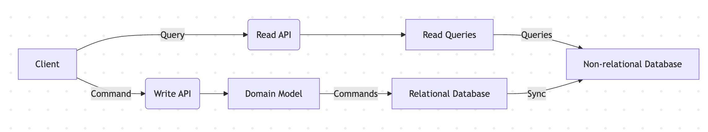

# .NET Core C# Clean Architecture, REST API, CQRS Event Sourcing, DDD, SOLID Principles

implementing the concepts of S.O.L.I.D, Clean Code,
CQRS (Command Query Responsibility Segregation) in DotNET 9.0

## **Technologies**

- ASP.NET Core 9.0
- Entity Framework Core 9.0
- **EF Compiled Queries** (https://learn.microsoft.com/en-us/dotnet/framework/data/adonet/ef/language-reference/compiled-queries-linq-to-entities)
- Unit & Integration Tests + xUnit + FluentAssertions (7.1.0)
- Polly
- AutoMapper
- FluentValidator
- MediatR
- OpenApi
- **Scalar** - Interactive API Reference from OpenAPI/Swagger (https://github.com/scalar/scalar)
- HealthChecks
- SQL Server
- MongoDB
- Redis (Cache)
- Docker & Docker Compose

## **Architecture**



- Full architecture with responsibility separation concerns, SOLID and Clean Code
- Domain Driven Design (Layers and Domain Model Pattern)
- Domain Events
- Domain Notification
- Domain Validations
- CQRS
- Event Sourcing
- Unit of Work
- Repository Pattern
- Resut Pattern

## Running the application

After cloning the repository to the desired folder, run the command in the terminal at the root of the project:

```csharp
dotnet clean Shop.sln --nologo /tl && dotnet build Shop.sln --nologo /tl
```

Next step, run the command in the terminal:

```csharp
docker-compose up --build --abort-on-container-exit --remove-orphans
```

Now just open the url in the browser:

```csharp
http://localhost:{port}/scalar/v1
```

## MiniProfiler for .NET

To access the page with the performance indicators and performance:

```csharp
http://localhost:{port}/profiler/results-index
```
