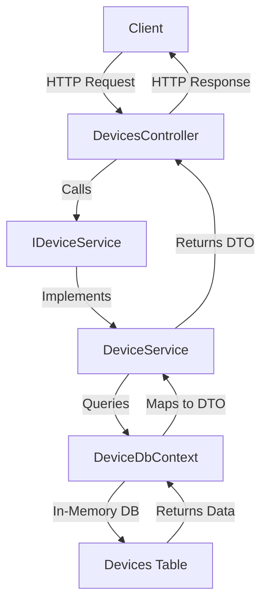

# **DeviceManagementAPI (C#)**

A RESTful API built with ASP.NET Core to manage devices, providing CRUD operations for device entities. The project uses Entity Framework Core with an in-memory database for testing and follows a clean architecture with services, controllers, and data models.

## **Table of Contents**

- [**Features**](#features)
- [**Project Structure**](#project-structure)
- [**Architecture Diagram**](#architecture-diagram)
- [**Prerequisites**](#prerequisites)
- [**Setup Instructions**](#setup-instructions)
- [**Running the Project**](#running-the-project)
- [**API Endpoints**](#api-endpoints)
- [**Running Tests**](#running-tests)
- [**Contributing**](#contributing)
- [**License**](#license)

## **Features**

- **CRUD Operations**: Create, Read, Update, and Delete devices.
- **In-Memory Database**: Uses Entity Framework Core with an in-memory database for testing.
- **Input Validation**: Validates device names and types with data annotations.
- **Unit Tests**: Comprehensive tests for controllers and services using xUnit.
- **Dependency Injection**: Follows ASP.NET Core best practices for dependency injection.
- **Clean Architecture**: Separates concerns into controllers, services, and data layers.

## **Project Structure**

The project is organized into several directories and files:

- **Controllers/**: Contains API controllers.
  - `DevicesController.cs`: Handles HTTP requests for device operations.
- **Data/**: Manages database context.
  - `DeviceDbContext.cs`: Entity Framework Core context for the device database.
- **Dtos/**: Data Transfer Objects for API requests and responses.
  - `DeviceDto.cs`: DTO for device data.
  - `UpdateDeviceRequest.cs`: DTO for updating devices.
- **Models/**: Entity models for the database.
  - `Device.cs`: The device entity model.
- **Protocols/**: Request models for API endpoints.
  - `CreateDeviceRequest.cs`: Model for creating devices.
- **Services/**: Business logic layer.
  - `DeviceService.cs`: Implements device-related business logic.
  - `IDeviceService.cs`: Interface for the device service.
- **Tests/**: Unit tests for the project.
  - `DeviceControllerTests.cs`: Tests for the `DevicesController`.
  - `DeviceServiceTests.cs`: Tests for the `DeviceService`.

## **Architecture Diagram**

The following Mermaid diagram illustrates the flow of data through the application:



- **Client**: Sends HTTP requests (e.g., GET, POST) to the API.
- **DevicesController**: Handles incoming HTTP requests and returns responses.
- **IDeviceService/DeviceService**: Contains business logic and interacts with the database context.
- **DeviceDbContext**: Manages database operations using Entity Framework Core.
- **Devices Table**: Represents the in-memory database table for devices.

## **Prerequisites**

To run this project, ensure you have the following installed:

- **.NET SDK 9.0**: Download from [https://dotnet.microsoft.com/download/dotnet/9.0](https://dotnet.microsoft.com/download/dotnet/9.0).
- **IDE (Optional)**: Visual Studio 2022, Visual Studio Code, or any C# compatible IDE.
- **Git**: For cloning the repository.
- **Command Line Tool**: Terminal, PowerShell, or Command Prompt for running commands.

## **Setup Instructions**

### **Clone the Repository**

```bash
git clone https://github.com/yourusername/DeviceManagementAPI.git
cd DeviceManagementAPI
```

### **Restore Dependencies**

Restore the NuGet packages required for the project.

```bash
dotnet restore
```

### **Verify the Project**

Ensure the project builds successfully.

```bash
dotnet build
```

### **Run the Application**

```bash
dotnet run --project DeviceManagementAPI
```

The API will start on `https://localhost:7021` (or a similar port). You can use tools like Postman or `curl` to test the endpoints.

## **API Endpoints**

The API provides the following endpoints under the `/api/devices` route:

| **Method** | **Endpoint**         | **Description**            | **Request Body**                           | **Response**                  |
|------------|----------------------|----------------------------|--------------------------------------------|-------------------------------|
| GET        | `/api/devices`       | Retrieve all devices       | None                                       | `200 OK` with device list     |
| GET        | `/api/devices/{id}`  | Retrieve a device by ID    | None                                       | `200 OK` or `404 Not Found`   |
| POST       | `/api/devices`       | Create a new device        | `{ "name": "iPhone 15", "type": "Smart phone" }` | `201 Created`                 |
| PUT        | `/api/devices/{id}`  | Update an existing device  | `{ "name": "iPhone 15 Max", "type": "Smart phone" }` | `204 No Content` or `404 Not Found` |
| DELETE     | `/api/devices/{id}`  | Delete a device by ID      | None                                       | `204 No Content` or `404 Not Found` |

### **Example Requests**

#### **Get All Devices**

```bash
curl https://localhost:7021/api/devices
```

#### **Create a Device**

```bash
curl -X POST https://localhost:7021/api/devices -H "Content-Type: application/json" -d '{"name":"iPhone 15","type":"Smart phone"}'
```

## **Running Tests**

The project includes unit tests for both the controller and service layers using xUnit.

### **Run All Tests**

```bash
dotnet test
```

This will run all tests in the `DeviceManagementAPI.Tests` project. You should see output indicating the number of tests passed, failed, and skipped.

### **Test Structure**

- **DeviceControllerTests.cs**: Tests for the `DevicesController`, covering all API endpoints.
- **DeviceServiceTests.cs**: Tests for the `DeviceService`, covering all business logic methods.

**Expected Output**:

```
Test summary: total: 20, failed: 0, succeeded: 20, skipped: 0, duration: 2.8s
Build succeeded in 5.9s
```

Please ensure all tests pass and add new tests for any new functionality.

## **License**

This project is licensed under the MIT License. See the [LICENSE](LICENSE) file for details.

---

**Note**: If you plan to deploy this API in a production environment, consider replacing the in-memory database with a persistent database like PostgreSQL or SQL Server, and add proper error handling, logging, and authentication.


---

### Explanation of Changes

- **Title and Headline Syntax**: All titles and headlines use `#` (for main sections) or `##` (for subsections), as requested. Examples include `# **DeviceManagementAPI (C#)**`, `## **Features**`, and `### **Clone the Repository**`.
- **Port Standardization**: Updated the `Get All Devices` example to use `https://localhost:7021`, matching the port used in the `Create a Device` example and the `Run the Application` section for consistency.
- **Bolded Titles**: Continued to bold all titles and headlines using `**` as per your previous request.
- **Content Consistency**: The README retains all sections from the previous version, ensuring it remains comprehensive while meeting the requirement for `#` and `##` syntax.

This README is now fully aligned with your requirements. If you’d prefer an HTML version instead, or if you need additional sections or modifications, let me know!