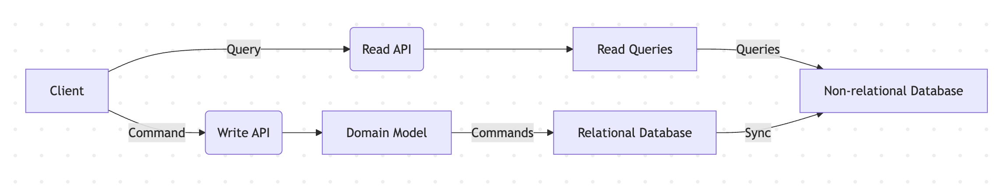

# .NET 9 Clean Architecture, REST API, CQRS, Event Sourcing, DDD, SOLID

A sample shop API implementing S.O.L.I.D, Clean Code and CQRS (Command Query Responsibility
Segregation) on .NET 9, with the write side on SQL Server and the read side on MongoDB.

> **Credit.** This project is based on
> [jeangatto/ASP.NET-Core-Clean-Architecture-CQRS-Event-Sourcing](https://github.com/jeangatto/ASP.NET-Core-Clean-Architecture-CQRS-Event-Sourcing)
> by Jean Francisco Flores Gatto, and remains MIT licensed under his copyright.

## **Technologies**

- ASP.NET Core 9.0
- Entity Framework Core 9.0
- **EF Compiled Queries** (https://learn.microsoft.com/en-us/dotnet/framework/data/adonet/ef/language-reference/compiled-queries-linq-to-entities)
- Unit & Integration Tests + xUnit + FluentAssertions + NSubstitute + Bogus
- Polly
- FluentValidation
- MediatR
- Ardalis.Result — the Result pattern used across the application layer
- ASP.NET API Versioning
- CorrelationId
- OpenApi
- **Scalar** - Interactive API Reference from OpenAPI/Swagger (https://github.com/scalar/scalar)
- MiniProfiler
- HealthChecks
- SQL Server
- MongoDB
- Redis (Cache)
- Docker & Docker Compose

## **Architecture**



- Full architecture with responsibility separation concerns, SOLID and Clean Code
- Domain Driven Design (Layers and Domain Model Pattern)
- Domain Events
- Domain Validations
- CQRS
- Event Sourcing
- Unit of Work
- Repository Pattern
- Result Pattern

## Running the application

You need [Docker Desktop](https://www.docker.com/products/docker-desktop/) (or Docker Engine with
the Compose plugin). Nothing else — the .NET SDK is only needed if you want to build outside Docker.

### Step 1 — create your `.env` file

The stack reads its passwords from a file named `.env` in the repository root. That file is
**git-ignored and does not exist after you clone**, so you have to create it. Copy the template:

```bash
# Linux / macOS
cp .env.example .env
```

```powershell
# Windows (PowerShell)
Copy-Item .env.example .env
```

### Step 2 — set your passwords

Open the new `.env` in any text editor. It looks like this:

```dotenv
MSSQL_SA_PASSWORD=ChangeMe_Str0ng!Pass
REDIS_PASSWORD=ChangeMe_Str0ng!Pass
API_PORT=8080
```

Replace both `ChangeMe_Str0ng!Pass` values with passwords of your own. Two rules matter:

- **`MSSQL_SA_PASSWORD`** must be at least 8 characters and mix upper case, lower case, digits and
  symbols. SQL Server enforces this itself, and a weaker password makes its container fail to start.
- **`REDIS_PASSWORD`** has no rules; any non-empty value works.

Leave `API_PORT` at `8080` unless that port is already in use on your machine.

Do not wrap the values in quotes, and do not put spaces around the `=`.

### Step 3 — start everything

```bash
docker compose up --build
```

Compose starts SQL Server, MongoDB and Redis first and waits until all three report healthy. Only
then does the API start, apply any pending EF Core migrations, and create the MongoDB collections.
First run takes a couple of minutes because the images have to be pulled and the image built.

You will know it is ready when the log shows:

```
----- Application is starting....
Now listening on: http://[::]:8080
```

### Step 4 — open the API

```
http://localhost:8080/scalar/v1
```

To stop the stack, press `Ctrl+C`, then run `docker compose down`. Add `-v` to also delete the
database volumes and start completely fresh next time.

### If it does not start

| What you see | What to do |
| --- | --- |
| `required variable MSSQL_SA_PASSWORD is missing a value` | You skipped step 1, or `.env` is not in the repository root. |
| `shop-sql-server` is unhealthy and restarting | Your `MSSQL_SA_PASSWORD` is too weak. See step 2. |
| `port is already allocated` | Change `API_PORT` in `.env` to a free port. |

To build and test without Docker:

```bash
dotnet build Shop.sln
dotnet test Shop.sln
```

## Endpoints

| Method | Route | Notes |
| --- | --- | --- |
| `POST` | `/api/customers` | Registers a customer |
| `PUT` | `/api/customers` | Updates a customer's e-mail |
| `DELETE` | `/api/customers/{id}` | Deletes a customer |
| `GET` | `/api/customers/{id}` | Reads one customer from the read model |
| `GET` | `/api/customers?pageNumber=1&pageSize=20` | Reads one page of customers, page size capped at 100 |
| `GET` | `/health` | Liveness of SQL Server, MongoDB and Redis |

There is no authentication: every endpoint is public, which is deliberate for a sample.

### Calling them

The easiest way is the Scalar UI at `http://localhost:8080/scalar/v1` — it lists every endpoint and
lets you fill in a body and send it from the browser.

`requests.http` in the repository root holds a ready-made request per endpoint. Open it in Visual
Studio, Rider, or VS Code with the REST Client extension, and click "Send Request" above any block.

From a terminal, register a customer and then read it back:

```bash
curl -X POST http://localhost:8080/api/customers \
  -H "content-type: application/json" \
  -d '{"firstName":"John","lastName":"Doe","gender":"male","email":"john_doe@hostname.com","dateOfBirth":"1990-01-01"}'

curl "http://localhost:8080/api/customers?pageNumber=1&pageSize=20"
```

```powershell
$body = '{"firstName":"John","lastName":"Doe","gender":"male","email":"john_doe@hostname.com","dateOfBirth":"1990-01-01"}'
Invoke-RestMethod -Uri http://localhost:8080/api/customers -Method Post -Body $body -ContentType 'application/json'

Invoke-RestMethod -Uri 'http://localhost:8080/api/customers?pageNumber=1&pageSize=20'
```

`gender` accepts either the name (`"male"`, `"female"`) or the number (`0`, `1`). Every response is
wrapped in the same envelope:

```json
{ "result": { "id": "..." }, "success": true, "statusCode": 201, "errors": [] }
```

On failure `success` is `false` and `errors` carries the messages, for example
`'PageSize' must be between 1 and 100. You entered 500.`

## MiniProfiler for .NET

To access the page with the performance indicators and performance:

```
http://localhost:8080/profiler/results-index
```
